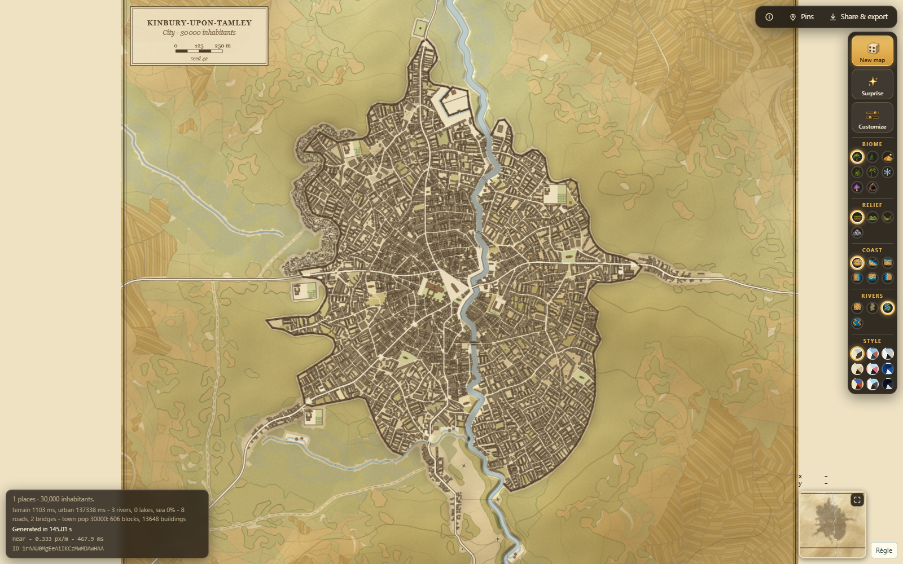
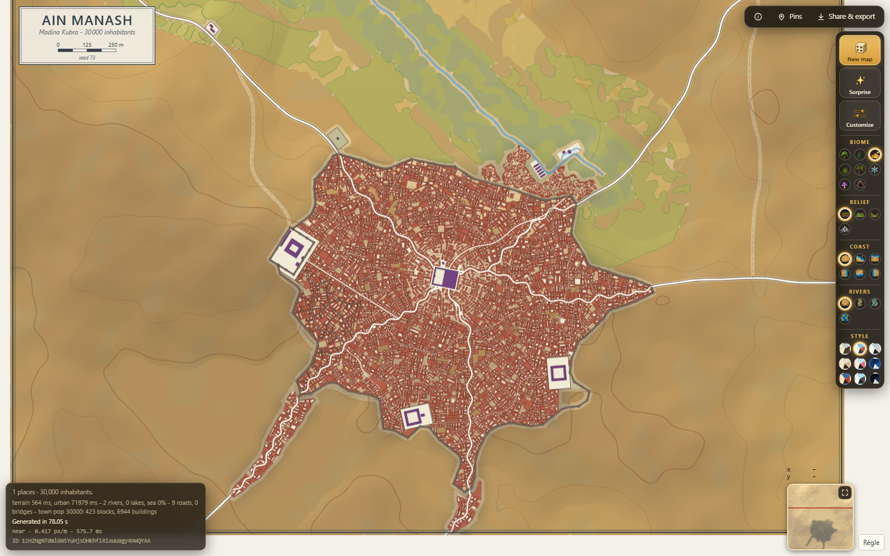
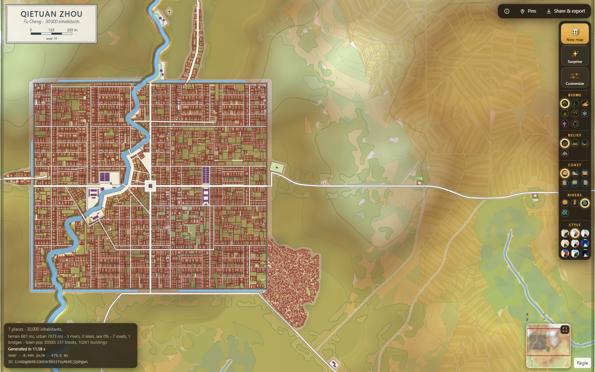
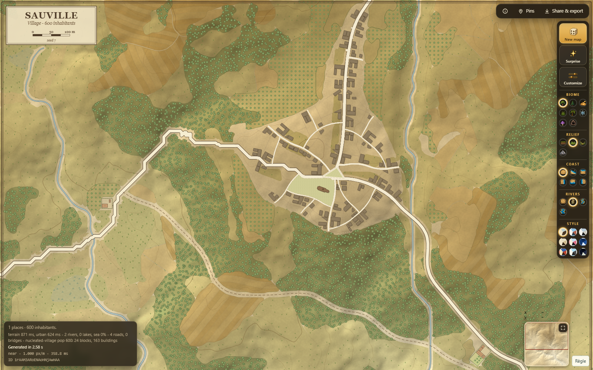

# Magna Urbis

**Magna Urbis est un travail inspiré de [TownGeneratorOS de Watabou (Oleg Dolya)](https://github.com/watabou/TownGeneratorOS) et de son [Medieval Fantasy City Generator](https://watabou.itch.io/medieval-fantasy-city-generator).** Le premier prototype Python est issu d'un port de TownGeneratorOS ; les moteurs TypeScript et Rust poursuivent cette exploration avec leurs propres implémentations.

**Projet en cours de développement · alpha · prototype.** Magna Urbis génère des implantations pré-modernes et leurs paysages pour la cartographie et le jeu de rôle. Les résultats, les performances et les interfaces évoluent encore : ce dépôt présente un travail expérimental, pas un logiciel achevé.

Le projet comporte **deux implémentations actives, TypeScript et Rust**. TypeScript est aujourd'hui la plus complète. Rust est en retard sur son périmètre fonctionnel, mais le rattrape progressivement, en commençant par le relief, les côtes et l'hydrologie.

À terme, Magna Urbis doit être intégré à **[Neural Earth](https://github.com/dunkean/neural-earth)** pour inscrire les villes et villages dans un monde procédural plus vaste. Cette intégration est un objectif de développement ; elle n'est pas encore livrée.

## Aperçus du prototype

Captures réelles de l'application TypeScript, avec des graines et réglages reproductibles. Les styles **Parchemin** et **Atlas** montrent aussi différentes morphologies urbaines. Ces images illustrent l'état actuel du prototype, avec ses imperfections.

### Grande ville médiévale · Parchemin



### Médina dans le désert · Atlas



### Ville chinoise planifiée · Atlas



### Village et campagne · Parchemin



Les [réglages des captures](docs/images/screenshots.json) permettent de retrouver ces exemples. Les captures proviennent de TypeScript ; Rust ne génère pas encore ces villes.

## Deux moteurs, deux niveaux d'avancement

| | TypeScript · `web/` | Rust / WASM · `rust/` |
| --- | --- | --- |
| Rôle actuel | Application de référence et prototype complet de génération d'implantations | Nouveau moteur expérimental, dans un banc séparé |
| Paysage | Relief, biomes, côtes, cours d'eau, lacs et occupation rurale | Relief, érosion, côtes, lacs et réseaux de rivières ; calcul CPU et chemins WebGPU selon les étapes |
| Implantations | Hameaux, villages, villes ; quartiers, rues, parcelles, bâtiments et monuments | Génération urbaine encore à venir |
| Interface | Carte interactive, paramètres, graines, liens de partage, exports SVG / PNG / JSON | Banc de terrain interactif, réglages par étape et diagnostics |
| Exécution | Navigateur, sans serveur de génération | Rust compilé en WebAssembly, exécuté dans le navigateur |

Le moteur TypeScript explore notamment les tracés organiques, les bastides, les médinas, les plans chinois et japonais, ainsi que des cultures fantastiques. Plusieurs cultures peuvent se combiner au fil des phases de croissance. Les grandes populations et leur détail progressif restent expérimentaux.

Le moteur Rust n'est pas encore un remplacement complet de TypeScript. Il réutilise temporairement une partie de l'interface et du rendu existants pour tester les étapes déjà portées. L'interface actuelle doit être conservée à terme ; le rendu actuel est une aide d'intégration provisoire, et le futur moteur de rendu reste à développer.

## Essayer l'application TypeScript

Prérequis : Node.js et npm. Utiliser une version LTS récente de Node.js.

```sh
cd web
npm ci
npm run dev
```

Ouvrir l'adresse indiquée par Vite, généralement **http://localhost:5173/**. Choisir l'environnement, puis les implantations, leur population et leur culture. Générer la carte et explorer au zoom. Une graine et les mêmes paramètres permettent de reproduire une génération pour une même version du moteur.

Le banc isolé de rues, parcelles et bâtiments est accessible à **`/testbench.html`**.

```sh
npm run build
```

Le build produit `web/dist/index.html` et `web/dist/testbench.html`, des pages autonomes utilisables hors ligne. **Le développement et le build TypeScript ne nécessitent pas Rust.**

## Essayer le prototype Rust

Prérequis supplémentaires : la toolchain définie dans `rust/rust-toolchain.toml`, la cible `wasm32-unknown-unknown` et `wasm-pack` dans le PATH. Sous Windows, prévoir les outils de compilation C++ de Visual Studio et le SDK Windows.

Installer la toolchain depuis `rust/`, puis lancer le banc depuis `web/` :

```sh
cd rust
rustup show
rustup target add wasm32-unknown-unknown
cargo install wasm-pack --locked
cd ../web
npm ci
npm run dev:terrain
```

Ouvrir **http://localhost:5173/terrainbench.html** ou l'adresse indiquée par Vite. La commande compile le WASM, lance le banc et recompile les sources Rust lors des modifications.

```sh
npm run wasm:terrain   # Recompiler le module WASM
npm run build:terrain  # Produire le banc autonome
npm run check:terrain  # rustfmt, Clippy et compilation WASM
```

Le build Rust produit `rust/out/browser/terrainbench.html`. Les modules WASM générés restent dans `rust/pkg/wasm/`. Ces sorties sont ignorées par Git et séparées de `web/dist/`.

Rust permet déjà d'explorer plusieurs familles de relief, de séparer l'étendue de carte et la taille des motifs, de régler l'érosion et les côtes, et d'inspecter l'hydrologie. La précision reste bornée par les grilles de calcul ; le zoom ne remplace pas une simulation à plus haute résolution. Les performances dépendent du relief, de la taille de carte et des capacités CPU/GPU du navigateur.

## Organisation du dépôt

```text
web/src/gen/      Moteur TypeScript et algorithmes de génération
web/src/render/   Rendu SVG et Canvas actuel
web/src/ui/       Interface, contrôles et workers
web/tests/        Tests TypeScript
web/scripts/      Aperçus, captures et vérifications de l'application
rust/crates/core/ Moteur Rust sans dépendance au navigateur
rust/crates/wasm/ Bindings WebAssembly
rust/bridge/      Adaptateurs temporaires vers l'interface et le rendu
rust/scripts/     Commandes de développement et de build Rust
town_generator/  Ancien prototype Python, conservé comme référence
tests/           Tests du prototype Python
docs/images/     Captures présentées dans ce README
```

Le prototype Python est historique ; il ne constitue pas un troisième moteur actif. Les notes internes de conception, documents de travail, audits et anciennes captures sont archivés localement et ne font pas partie des fichiers suivis par Git. Les licences et les crédits des dépendances et ressources restent dans le dépôt.

## Vérifier et contribuer

Depuis `web/` :

```sh
npm run typecheck
npm run test:fast
npx vitest run tests/urban.determinism.test.ts
npm run build
```

`npm test` lance également la matrice exhaustive des villes et cultures ; prévoir plusieurs dizaines de minutes. `npm run test:slow` permet de lancer cette matrice séparément.

Pour produire un aperçu de carte :

```sh
npm run preview:png -- --seed 42 --size town --out out/check.png
```

Pour refaire les captures du README après un build :

```sh
node scripts/readme_screenshots.mjs
```

Pour vérifier le prototype Python, depuis la racine : `python -m pytest tests/ -q`.

Pour signaler un problème, joindre la version utilisée, la graine, les paramètres et le lien de partage, avec une capture si possible. L'application propose également des pins et la copie d'un rapport de bug. Les formats, les résultats et les liens de génération peuvent évoluer pendant cette alpha.

## Crédits et licence

Merci à **Watabou** pour TownGeneratorOS et Medieval Fantasy City Generator, qui sont à l'origine de ce projet et restent une référence majeure.

Magna Urbis est distribué sous la **GNU GPL v3** ; voir [LICENSE](LICENSE). Le prototype Python conserve sa filiation avec TownGeneratorOS. Les ressources et dépendances tierces gardent leurs propres notices de licence et de provenance dans les dossiers correspondants.
