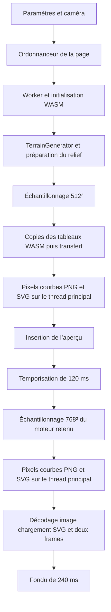

# Audit des performances du relief Rust

Mesures du 6 octobre 2026. Le banc actif intègre les optimisations CPU exactes,
les bruits GPU FP32, le sampling GPU FP32 et maintenant une variante d'érosion
régionale entièrement GPU (`generation=gpu-erosion`). Le renderer reste inchangé.
Le FP16 a été retiré après les artefacts observés par l'utilisateur.

Sur le cas utilisateur collines 5 km `lp13l2`, érosion 62 %, le GPU prend
**397 ms au premier appel, puis 198–209 ms**, contre **1 354–1 501 ms** en CPU,
hors sampling et rendu. Cette variante change la topologie du drainage et reste
soumise à sa validation visuelle. Ce résultat ne prouve pas 250 ms pour toutes
les familles/cartes. Les sections plus anciennes conservent les étapes mesurées
avant le port GPU de l'érosion.

## Érosion GPU complète et correction du drainage rectiligne

`terrainErosion.wgsl` exécute les bruits initiaux, l'uplift, le minimax flood,
le drainage D8/D-infinity, l'accumulation, l'incision implicite, l'union-find des
cuvettes et leur remplissage/breaching, la relaxation thermique, la diffusion,
la reconstruction 1024², le ridge, les percentiles et la normalisation en FP32.
Le cœur Rust fournit les mêmes paramètres scalaires, graines et tables de bruit,
à travers `GenerationNoisePlan::erosion`. Les grilles restent 320²/640² et 1024² ;
les nombres d'itérations restent ceux de la référence, sans réduction du détail.
Le raster physique final revient à Rust via `TerrainEngine.with_source` pour
l'assemblage et les mips (~4 ms dans les diagnostics de données).

Le scheduler conserve tous les intermédiaires sur GPU et encode les passes dans
un seul compute pass, avec variantes uniformes à offsets dynamiques. Les groupes
16×16 utilisent une bordure de lecture de 1 cellule et 16 propagations locales ;
chaque dispatch global synchronise les tuiles. Accumulation et incision attendent
respectivement tous les donneurs et tous les receveurs. Les compteurs valident
la convergence ; une erreur relance la génération GPU avec budget ×2 puis ×4,
avant un repli CPU explicitement diagnostiqué. Les pipelines sont réutilisés.
Les transferts finaux ne sont pas masqués dans le temps de préparation.

La première variante portait les niveaux remplis puis utilisait un nombre de
sauts D8 unitaire et un ordre fixe pour départager les flats. L'utilisateur a
signalé des lignes droites sur `lp13l2`, collines, carte 5 km, motif 3 km,
érosion .62, Atlas. La correction utilise des distances cardinales/diagonales
physiques, un coût positif qui favorise les creux du terrain existant, une
priorité reproductible seedée pour les égalités et D-infinity sur le potentiel
des flats également. Cette priorité influe sur le routage, sans ajout direct de
bruit ou de pente artificielle dans les altitudes. Un cache supplémentaire de
ces coûts en mémoire partagée a été essayé puis écarté : son occupation et ses
barrières n'ont pas amélioré les temps mesurés.

Diagnostic du graphe final, montagnes seed 42, érosion .5, motif 3 km : les suites
de receveurs de même niveau rempli et même direction D8 passent de **89 à 27**
cellules au maximum sur 12 km, et de **53 à 25** sur 30 km. Les cellules démarrant
une suite d'au moins 8 pas passent de 38 714 à 2 927, et de 22 433 à 2 538.
Ce diagnostic établit la baisse du biais axial ; il ne remplace pas le jugement
visuel. Sur le cas utilisateur, les longues tranchées rectilignes du rendu initial
ont disparu dans l'image inspectée, et la référence CPU reste sélectionnable.

Chrome installé / GPU NVIDIA Ampere, `terrain_erosion_gpu_audit.mjs`, préparation
incluant calcul, dispatch, readback et assemblage Rust, hors sampling/rendu :

| Cas | Préparation CPU | Préparation GPU FP32 |
|---|---:|---:|
| Collines 5 km `lp13l2`, .62 — premier appel | 1 501 ms | 397 ms |
| Même cas — deux générations chaudes | 1 354–1 423 ms | 198–209 ms |
| Montagnes 3 km, .5, `42-1`/`42-2` | 1 558–1 627 ms | 404–448 ms |
| Collines 3 km, .5, `42-1`/`42-2` | 1 450–1 460 ms | 198–230 ms |
| Vallée 3 km, .5, `42-1`/`42-2` | 1 633–1 639 ms | 358–377 ms |
| Montagnes 12 km, .5, `1a72a9n` | 5 882 ms | 1 275 ms |

Les temps varient avec la charge de compilation/browser ; ne pas comparer ces
passes à un rendu mesuré séparément. Les diagnostics `current`, `boundary`,
`lines` couvrent 17 cas après correction, dont érosion 0/1, mixte .75, hautes
montagnes et cartes de 12/30 km. Tous ont réellement utilisé l'érosion GPU,
avec altitudes/normales finies et sans erreurs de page. Le même cas utilisateur
reconstruit trois fois donne le même SHA-256 FP32 ; aucun cache de génération
ne remplace ces reconstructions, puisqu'un terrain CPU est préparé entre elles.

**Limite de qualité :** le priority flood parallèle départage les flats
différemment du heap CPU, et les breaches simultanés fusionnent les baisses
concurrentes au lieu de les appliquer séquentiellement. Le résultat n'est pas
identique : sur le cas utilisateur, différence de hauteur RMS 8,46 m,
maximum 35,12 m ; sur les collines 3 km elle atteint ~12 m RMS. Le faible écart
des seuls bruits fins GPU ne doit pas être présenté comme celui de l'érosion
complète. Le mode fin reste le défaut et conserve l'érosion CPU ; l'utilisateur
valide la variante complète dans le bench. Les cinq familles régionales sont
couvertes, pas les familles volcaniques/plaine/caverne.

L'erreur Naga `rootOf` signalée par l'utilisateur est corrigée par une boucle
bornée et un retour final explicite. Le shader complet corrigé est accepté par
Naga 30.0.1 et Chrome. Firefox headless n'a pas fourni d'adaptateur GPU ; cela ne
valide pas le chemin matériel Firefox. Le build autonome a été ouvert en
`file://` avec réseau HTTP bloqué : démarrage GPU, changement CPU/GPU et véritable
absence de WebGPU passent sans erreurs de page/console. Typecheck, builds terrain
et application indépendante, fmt/Clippy et compilation WASM passent. Ces contrôles
restent des diagnostics ponctuels, sans nouvelle suite ou CI.

Sources de mesure ignorées : `erosion-gpu-{current,boundary,lines,repeat}.json`,
`drainage-{before,after}.json`, `erosion-offline.json` dans `rust/out/perf-audit/`.
Pour refaire les comparaisons depuis `web/` : `npm run build:terrain`, puis
`node node_modules/vite/bin/vite.js --mode terrainbench --port 5173` dans un
terminal, et `node scripts/terrain_erosion_gpu_audit.mjs lines` dans un autre.

## Accélération réelle de la préparation : GPU FP32 et voisinages réutilisés

Après le rejet visuel du FP16, deux chemins de bruits de génération sont
intégrés au banc actif. Le mode par défaut `generation=gpu` évalue sur GPU
les deux FBM de warp et le ridge de détail sur la grille 1024². Les bruits
initiaux de la grille d'érosion restent CPU, ce qui conserve son drainage.
Le mode `generation=gpu-all` calcule également les trois bruits initiaux
sur GPU (grille 320² ou 640² inchangée). `generation=cpu` reste la référence.
Toutes les valeurs GPU et accumulations des shaders sont FP32 ; le FP16 a
été retiré de l'UI et des exports actifs. Le simplex/FBM WGSL est partagé avec
le sampler, sans nouvelle octave ni changement de longueur d'onde physique.

La préparation Rust accepte temporairement des champs numériques externes,
sans dépendance GPU dans le core. La simulation conserve le priority flood,
le drainage D-infinity, les additions ordonnées, l'incision, le talus et la
diffusion CPU. Les voisins D8 et les cellules de bord sont préparés une fois,
puis réutilisés à chaque itération. Leur ordre est identique à la référence.
Le renderer, le rasterizer, les palettes et les courbes ne sont pas modifiés.

Chrome installé / adaptateur NVIDIA Ampere, carte 3 km, motif 3 km, érosion
50 %, détail 768². Trois générations chaudes, graines `42-1`, `42-2`, `42-3`,
après un premier passage `42-0` conservé séparément. Chaque graine change
pour forcer une vraie préparation : ces temps ne mesurent pas le réemploi
d'un champ. Médianes de préparation, incluant dispatch, lecture GPU, copies
vers WASM, construction et normalisation Rust ; hors échantillonnage/rendu :

| Relief | Avant cette étape | CPU avec voisinages | Bruits fins GPU + voisinages | Gain depuis avant |
|---|---:|---:|---:|---:|
| Montagnes | 1 540 ms | 1 423 ms | 1 149 ms | 25,4 % |
| Collines | 1 397 ms | 1 311 ms | 1 006 ms | 28,0 % |
| Vallée | 1 573 ms | 1 488 ms | 1 173 ms | 25,4 % |

Les bruits fins GPU prennent environ 14–18 ms dispatch, lecture et copies compris,
après compilation ; le premier appel de ce pipeline coûte 72 ms ici, après
quatre préparations CPU. Ce n'est donc pas un chargement d'application froid.
L'échantillonnage GPU reste environ 16–30 ms, **séparé du gain de préparation**.
Le restant Rust est encore autour de 1 s : les 250 ms ne sont pas atteints.
Il inclut la simulation et la reconstruction de la grille fine, pas seulement
l'érosion. Le diagnostic UI affiche « suite Rust » pour éviter cette confusion.

Sur 12 scènes (trois familles × quatre graines), les bruits fins GPU changent
la hauteur d'au plus 0,58 mm, RMS maximal 0,16 mm, avec le même sampler FP32
pour isoler la précision de génération. Les 12 empreintes CPU sont identiques
avant/après le cache de voisinage ; les 12 empreintes de génération entièrement
GPU sont également conservées par ce changement CPU. Ces observations ne
constituent pas une identité binaire universelle de FP32 avec la référence f64.

Le mode « tous bruits GPU » gagne seulement quelques dizaines de millisecondes
supplémentaires dans ces mesures. Les écarts initiaux FP32 peuvent réorienter
le drainage : jusqu'à 20,5 m d'écart local de hauteur dans ces graines, RMS
maximal 1,44 m. Ce mode reste disponible pour la validation visuelle demandée,
avec la même graine/caméra ; le mode fin conserve les conditions initiales CPU.
L'utilisateur décide de l'apparence, sans seuil automatique de rejet visuel.

Sources et données : `generation-before/manifest.json` conserve les sources
CPU antérieures à cette étape, avec leur package WASM. `generation-before.json`,
`generation-noise.json`, `generation-grid-noise.json`, `generation-quality.json`
et `generation-final.json` sont ignorés dans `rust/out/perf-audit/`. Reproduire
la mesure actuelle depuis `web/` avec le serveur terrain actif sur 5173 :

```powershell
node scripts/terrain_generation_audit.mjs current
```

Le banc interactif actuel est servi par `node scripts/terrain_audit_preview.mjs live`
sur 5175. Ses URL utilisent `compute=wasm|gpu-f32` et
`generation=cpu|gpu|gpu-all`. Le diagnostic indique toujours les backends réels,
la préparation complète, les bruits GPU, la suite Rust, l'échantillonnage et le
rendu. Les changements de caméra réemploient les champs ; changer le mode de
génération reconstruit le terrain. En cas de perte du device, un champ préparé
reste utilisable par le sampler CPU. Les erreurs GPU déclenchent un repli CPU.

Vérifications finales : rustfmt, Clippy natif tous targets, compilation WASM,
typecheck et builds terrain autonome/application indépendante passent. Le
contrôle navigateur termine sans erreur de page et sans valeur non finie dans
dix couples relief/région, avec érosion 0/50/100 %, source coarse 320 et 640.
Le build autonome fonctionne en GPU FP32 avec zoom et changements rapides de
génération ; un Chromium sans adaptateur utilise réellement le repli CPU.
Le chargement autonome froid de la vallée/graine 42 prend ici 1 677 ms de
préparation (147 ms de bruits, 1 530 ms de suite Rust), puis 1 171 ms après
changement de génération. Les gains à chaud du tableau ne promettent donc
pas ce même pourcentage sur le tout premier chargement.
Le contrôle à 8 km retrouve l'écart déjà connu du sampler FP32 vallée (~0,296 m
en vue complète, ~1 mm au zoom) ; les bruits fins n'ajoutent pas de changement
de drainage. Aucun screenshot, suite de tests, commit ou publication ajouté.

## Mesures et comparaison

Les tableaux de cette section décrivent la référence avant intégration. Le
harness est épinglé au commit `30422f1e2404d35d83088352fd8cb252bd9eb92d` pour
reproduire ces comparaisons même après les modifications du moteur.

Machine : i7 10700K, 8 cœurs / 16 processeurs logiques, RTX 3090 présente.
Les premières tables ci-dessous utilisent un seul thread CPU. Les essais GPU
distincts, présentés plus loin, utilisent l'adaptateur NVIDIA Ampere, sans fallback.
Navigateur de mesure : Chromium 153.0.8010.12, Playwright, viewport 1440 × 1000.
Rust 1.99.0. Deux compilations de référence : développement optimisé niveau 2,
et release niveau 3 avec LTO thin, sans wasm-opt. Les essais sont comparés à
la référence release.

Le banc actuel reproduit le problème en plaine, graine 42, carte et motif 3 km,
érosion 50 % : **1 857 ms génération + aperçu**, **1 206 ms détail**, **184 ms
rendu du détail**. Le détail est présenté environ **3 536 ms après l'envoi de
la génération**, avant la fin de son fondu de 240 ms. Le chargement de la page
et de ses modules est séparé de ce délai.

Pour la plaine, trois graines (`42`, `1`, `1a72a9n`), trois répétitions et trois
doses ont été mesurées en alternant référence et variante. Tableau des médianes
des neuf mesures par dose et variante, en millisecondes :

| Érosion | Préparation actuelle | Préparation optimisée | Aperçu actuel 512² | Aperçu optimisé 512² | Détail actuel 768² | Détail optimisé 768² |
| --- | ---: | ---: | ---: | ---: | ---: | ---: |
| 0 % | 235 | 90 | 396 | 242 | 874 | 536 |
| 50 % | 1 156 | 768 | 535 | 276 | 1 186 | 676 |
| 100 % | 1 166 | 768 | 536 | 276 | 1 195 | 673 |

À 50 %, la somme préparation + deux échantillonnages passe de **2 877 à
1 720 ms**, soit **40,2 % de moins**. Le rendu actuel du détail reste autour
de 134–137 ms dans ces passages réchauffés, puisque son code est identique.
La somme des médianes décrit ces étapes ; elle n'est pas une mesure de frame.

Les autres familles ont chacune un passage exploratoire, graine 42,
carte/motif 3 km, érosion 50 %. Elles ne disposent pas des neuf répétitions
de la plaine :

| Relief | Préparation actuelle | Préparation optimisée | Détail actuel 768² | Détail optimisé 768² |
| --- | ---: | ---: | ---: | ---: |
| Plaine | 1 315 | 926 | 1 236 | 689 |
| Collines | 1 586 | 1 488 | 650 | 160 |
| Montagnes | 1 579 | 1 412 | 647 | 161 |
| Mixte | 1 562 | 1 446 | 650 | 160 |
| Vallée | 1 559 | 1 425 | 1 610 | 904 |
| Plateau | 2 987 | 2 781 | 1 677 | 756 |
| Haute montagne | 1 558 | 1 440 | 650 | 162 |
| Volcan | 4 989 | 4 769 | 1 898 | 881 |
| Caldeira | 5 087 | 4 780 | 1 966 | 909 |
| Caverne | < 1 | < 1 | 6 010 | 3 974 |
| Canyon interne | 8 221 | 7 874 | 2 330 | 1 304 |

Le canyon est mesuré par l'API ; il reste retiré du sélecteur de l'interface.
La caverne bénéficie d'un essai supplémentaire décrit plus bas.

**Équivalence vérifiée :** 165 comparaisons de régions, incluant les variantes
de compilation, les onze reliefs à 512² et 768², les répétitions de plaine et
quinze régions de zoom. Les SHA-256 des altitudes, des trois normales et du
masque, ainsi que les min/max, sont identiques. Les SVG sont identiques sur
les cas comportant un rendu. Les zooms utilisent une carte de 8 km, motif 3 km,
graine `1a72a9n`, érosion 38 %, des origines non entières, une résolution 127,
et des fenêtres de 48,5 m et 8 m en 768². Cette dernière vérifie aussi le
cas où le pas minimal des normales dépasse la demi-cellule.

L'ancien temps de 250 ms n'a pas été mesuré sur son ancienne révision avec
ces entrées. Le checkpoint `9b726d9` avait une source 512², contre 1024²
aujourd'hui. Réduire la source pour retrouver son temps changerait la qualité
et ne constitue pas une optimisation équivalente.

## Parcours complet du calcul et de la présentation



Les points d'entrée sont [terrainbench.ts](../../web/src/ui/terrainbench.ts),
[terrainWorker.ts](../../web/src/ui/terrainWorker.ts),
[terrain.ts](../bridge/terrain.ts), la
[façade WASM](../crates/wasm/src/lib.rs),
[engine.rs](../crates/core/src/engine.rs),
[lib.rs](../crates/core/src/lib.rs),
[erosion.rs](../crates/core/src/erosion.rs), puis
[terrainRender.ts](../bridge/terrainRender.ts),
[raster.ts](../../web/src/render/raster.ts) et
[contour.ts](../../web/src/gen/terrain/contour.ts).

Le moteur est retenu par configuration dans le worker. Une région supplémentaire
ne relance pas l'érosion. La génération affichée englobe **construction du moteur,
échantillonnage de l'aperçu et getters** ; le détail affiche ces deux dernières
étapes seulement. Le rendu affiché après le détail remplace le temps du rendu
de l'aperçu. Les indicateurs n'incluent pas le chargement WASM, la file d'attente,
les temporisations, le décodage, les frames ou la durée du fondu. Le rapport
copié indique encore « source physique 512² », alors que `SOURCE_N` vaut 1024.

### Préparation selon le relief

| Chemin actif | Calculs principaux |
| --- | --- |
| Plaine | Raster 1024² initial et érodé calculés séparément ; grille d'érosion 320 + 24 cellules de marge, 12 passes ; normalisation indépendante, différence, pyramides. Dose effective à la puissance quatre. |
| Collines | Uplift sur grille 320², ou 640² si carte > 3 motifs ; 18 itérations ; flood, drainage partagé, résolution de cuvettes, incision, trois passes thermiques par itération, diffusion ; reconstruction 1024² et détail. |
| Montagnes, mixte, haute montagne | Même famille de calculs, 22 itérations ; paramètres d'amplitude, talus, diffusion et détail propres à chaque famille. |
| Vallée | Préparation du relief mixte puis profil analytique du tronc et des affluents lors de chaque échantillonnage. |
| Plateau | Motif local 1024², érosion sur 320 + marge / 12 passes, plus préparation complète d'un fond mixte régional ; masque de protection du sommet. |
| Volcan et caldeira | Motif local, érosion sur 640 + marge / 12 passes, plus fond mixte régional ; protection du cratère et raccord aux montagnes. |
| Caverne | Pas de raster ni d'érosion préparés ; distance analytique à 14 chambres et 13 liaisons, bruit de frontière et de sol, masque roche et normales. |
| Canyon interne | Fond mixte, réseau de segments indexés, évaluation géographique sur 1024², érosion de parois 640 + marge / 24 passes, recalcul du masque et pyramide de correction. |

Les variantes legacy de vallée/canyon/caverne présentes dans `generate_motif`
ne sont pas toutes empruntées par le moteur retenu : la vallée et le canyon y
demandent un fond mixte, et la caverne contourne cette préparation. Les anciennes
projections périodiques ne sont plus le chemin actif à optimiser.

### Échantillonnage

`sample_region` appelle cinq fois `height_at` par pixel : centre, gauche,
droite, haut et bas. Pour 768², cela représente **2 949 120 évaluations**.
Les normales utilisent le même relief filtré que les courbes et un pas
`max(motif / 65536, cellule / 2)` : conserver ce contrat est essentiel.

La plaine évalue quatre octaves de houle, quatre de relief doux et deux fois
deux octaves de déformation de la correction d'érosion. À 3 km / 768²,
ces bandes restent résolues : environ **35,4 millions d'appels simplex**
avec les cinq évaluations par pixel. Les surfaces préparées utilisent une
pyramide filtrée et une interpolation B-spline de 16 points par niveau ;
le niveau de filtrage est recalculé par `log2` à chaque appel.

Le bruit `rough` est évalué avant le choix du relief, même pour les branches
qui ne le lisent pas. Le même gaspillage existe dans la boucle de préparation
du motif. Le compilateur ne l'élimine pas suffisamment : le rendre conditionnel
produit un gain mesuré particulièrement fort en montagne.

### Transferts et rendu

Les quatre grilles Float32 d'un détail 768² pèsent **9 MiB**. Chaque getter
clone son Vec en Rust, puis wasm-bindgen fait une copie `.slice()` vers JS.
Le `postMessage` utilise ensuite correctement des buffers transférables.
La moyenne des getters de la matrice est d'environ **2 ms** ; dans le banc
actuel, le transport du détail de plaine ajoute moins de 1 ms au calcul annoncé.
Ce n'est pas le premier goulot à corriger.

Le rendu partage le rasterizer existant, avec normales fournies, exagération
fixe, sans grain ni hachures. Il crée les pixels RGB, encode le PNG par fflate
au niveau 6, convertit en base64, parcourt chaque niveau de courbes, formate
les points et compose le SVG. Ces étapes s'exécutent sur le thread principal.
Le changement de style relance le rendu d'aperçu puis demande un nouveau détail
Rust : le cache actuel stocke surtout des scènes déjà stylées, pas les données
de région réutilisables indépendamment du style.

## Profils des noyaux

Le profil navigateur `browser.cpuprofile` couvre plaine, montagne, vallée et
volcan. Ses principaux postes exclusifs sont le simplex (~4,95 s),
`neighbor` (~3,37 s), `pow` logiciel (~2,37 s), l'accès/interpolation des
surfaces (~2,31 s), l'érosion, puis la compression PNG. Ces temps sont ceux
de cette trace combinée en profil développement ; ils ne sont pas des
pourcentages propres à la plaine release.

L'instrumentation native précise les dépendances. Pour la plaine, préparation
789 ms, dont érosion grossière 355 ms : poids de drainage 172, tris 54,
accumulation 50, incision 45, thermique 26 et diffusion 7 ms. L'érosion avec
reconstruction coûte 384 ms et les deux normalisations 59 ms. Pour la montagne,
les floods prennent 389 ms et le drainage partagé 211 ms sur 1 303 ms de
préparation. Ces chiffres natifs identifient les phases ; le navigateur reste
la référence pour les gains annoncés.

Les boucles de poids et de voisinage sont coûteuses, mais l'accumulation du
drainage et l'incision lisent les résultats précédents selon un ordre précis.
Les paralléliser naïvement, utiliser des atomiques Float32 ou changer l'ordre
des égalités altérerait le résultat. Les itérations d'érosion sont aussi
dépendantes les unes des autres.

Le profil supplémentaire `cavern.cpuprofile` explique le cas extrême : environ
2,96 s dans la FMA logicielle et 1,41 s dans `hypot`, contre 0,41 s dans le
simplex. Le calcul robuste de la norme utilise une FMA logicielle coûteuse
dans ce WASM, alors que les coordonnées du prototype sont bornées.

## Optimisations déjà éprouvées en copie isolée

1. **Évaluer le bruit uniquement dans les branches qui l'utilisent.** Aucun
   changement de formule des branches actives. Gain majeur sur les normales
   de montagnes et sur la génération de la plaine.
2. **Partager les valeurs communes des normales.** Quand le pas vaut une
   demi-cellule, le bord droit d'un pixel et le bord gauche du suivant sont
   communs ; même principe vertical. On approche trois évaluations par pixel
   au lieu de cinq. L'essai compare les bits des coordonnées Float64 avant
   réutilisation, pour conserver les arrondis et le comportement au zoom fin.
3. **Préparer le niveau de filtrage une fois.** Même footprint pour toute une
   région : mêmes deux niveaux et poids de mélange. L'essai utilise un cache
   expérimental dans `Surface` ; l'intégration devrait plutôt passer un contexte
   de région immuable, compatible avec des échantillonnages parallèles.
4. **Ne pas interpoler un second niveau dont le poids vaut zéro.** Le résultat
   reste le même, en particulier sur l'aperçu des reliefs régionaux.
5. **Calculer une seule fois le terrain brut de la plaine.** Cloner ce terrain
   avant l'érosion et normaliser séparément les deux branches. Soustraire une
   correction grossière directement ferait perdre la normalisation actuelle.
6. **Sélectionner le percentile exact au lieu de trier un million de valeurs.**
   `select_nth_unstable_by` avec `f32::total_cmp` garde le même p1 et fonctionne
   en temps linéaire. [Documentation Rust](https://doc.rust-lang.org/std/primitive.slice.html#method.select_nth_unstable_by).
7. **Calculer les fractions de drainage en ordre raster.** Chaque cellule est
   indépendante dans cette phase. L'accumulation et l'incision gardent leur
   ordre actuel et leur résultat.

Ces sept essais combinés correspondent à la variante `candidate-lod` des
tableaux. Les gains ne doivent pas être additionnés individuellement.

### Encodage PNG natif

À 768², le rendu des pixels coûte environ 39–43 ms. L'encodage fflate mesuré
sur la matrice coûte 72–183 ms, les courbes 8–60 ms, l'insertion DOM 1–8 ms
et le décodage environ 4–11 ms. Les coûts de base64 fluctuent avec les allocations.

L'essai convertit le RGB en RGBA opaque, utilise `OffscreenCanvas.putImageData`,
puis `convertToBlob({ type: 'image/png' })`. **Conversion, mise en Canvas et
encodage ensemble prennent 14–32 ms en 768².** Vingt-huit décodages de PNG
de surface rendent exactement les mêmes octets RGBA. Les fichiers compressés
changent, les pixels restent identiques. Le masque noir de caverne n'est pas
inclus dans ces vingt-huit essais de transport.

Cette voie peut conserver les mêmes `<image>` SVG et les mêmes courbes, via
des URL de Blob dont la durée de vie suit le cache. L'exécuter dans le worker
retire aussi les longues tâches du thread principal. Garder le chemin existant
en secours et contrôler les palettes, le décodage SVG, le fondu et l'offline.
[API du navigateur](https://developer.mozilla.org/en-US/docs/Web/API/OffscreenCanvas/convertToBlob).

### Mathématiques en WASM

Un essai de `Math.pow` importé à la place de la puissance 1,1 du drainage
retire environ 116 ms à la préparation de la plaine froide, et 330–370 ms
à celles des volcans/caldeiras. Les quatre cas rendus vérifiés restent identiques.
Le gain du plateau n'est pas établi. Ce chemin ajoute des appels WASM/JS et
les bibliothèques mathématiques peuvent différer selon le navigateur : mesurer
sur plusieurs moteurs avant de le préférer à un noyau WASM amélioré.

Pour la caverne, l'essai `candidate-cave` remplace seulement les normes
géométriques `hypot(dx, dy)` par `sqrt(dx*dx + dy*dy)`. Avec les sept optimisations,
le détail 768² prend **533, 539 et 554 ms** sur les trois graines, contre
3 786–3 889 ms avec les sept optimisations seules, et environ 6 010 ms dans
la référence initiale. Altitudes, normales, masque et SVG sont identiques
à 512² et 768² sur ces trois graines. Les carrés ne peuvent déborder dans
les coordonnées autorisées, mais les arrondis Float64 intermédiaires diffèrent :
ce résultat ne prouve pas une identité universelle. Étendre les comparaisons
aux frontières, motifs extrêmes et zooms avant intégration.

## Ordre recommandé pour la suite

### Première étape sans changement de qualité

Intégrer les sept optimisations exactes, puis l'encodage natif et le rendu
dans un worker. Séparer dans les diagnostics initialisation, préparation,
échantillonnage, copies, file d'attente, pixels, courbes, encodage et délai
jusqu'à la première image présentée. Garder le moteur Rust et le rendu actuel
comme références pour la comparaison des tableaux et pixels.

Éviter la succession obligatoire aperçu 512² → rendu → attente → détail
768² lorsque la région visible correspond à la carte entière. Un premier
768² direct conserve le détail final exact et retire une passe redondante.
Ce choix doit rester conditionnel : à une vue déjà zoomée sur une grande carte,
l'aperçu global sert aux déplacements et ne se confond pas avec la région.
Une vignette 512² redimensionnée depuis 768² ne reproduit pas forcément son
filtrage actuel.

Conserver un cache de données et de courbes **indépendant du style**. Une palette
différente ne justifie ni une nouvelle érosion, ni un nouvel échantillonnage.
Réutiliser le fond mixte entre plateau, volcan et caldeira lorsque ses entrées
sont identiques ; retenir le terrain brut indépendant de la dose pour les
changements du curseur. À érosion nulle, la plaine peut éviter le raster
préparé inutilisé et les bruits de projection d'une correction vide. Éviter
aussi sa pyramide `source`, non lue par l'échantillonnage de cette famille.
Ces dernières suppressions restent à mesurer séparément.

### Noyaux CPU et parallélisation

| Travail | Action | Contrat à préserver |
| --- | --- | --- |
| Voisins D8 | Calculer les coordonnées/indices une seule fois par cellule ; traiter l'intérieur sans divisions ni contrôles de bord répétés ; comparer pré-calcul compact et offsets directs. | Même voisin, même visite et mêmes frontières. |
| Poids du drainage | Traiter des lignes indépendantes en parallèle ; éviter les puissances des pentes nulles. | Même somme des huit poids par cellule et mêmes conversions Float32. |
| Préparation du bruit | Partager les paramètres constants, plans d'octaves et poids ; calculer les cellules en parallèle. | Mêmes coordonnées, amplitudes, octaves et ordre arithmétique local. |
| Interpolation | Préparer indices et poids par axe pour les reconstructions régulières ; spécialiser les accès intérieurs. | Même B-spline et accumulation ; une passe séparable réordonne les additions. |
| Normales et pixels | Répartir les lignes dans un pool de 2 à 4 workers puis mesurer 8 ; conserver les évaluations communes. | Calcul des coordonnées à partir de l'indice global, même epsilon et même footprint. |
| Flood et flux | Réutiliser rank, buffers, heap et capacités ; limiter les divisions, atan2 et hypot. | Conserver les égalités du heap et l'ordre topologique, pas de changement d'incision. |
| Thermique et diffusion | Réutiliser les scratch buffers ; paralléliser les écritures indépendantes de diffusion. | Les contributions thermiques actuellement additionnées dans un ordre précis ne se réduisent pas librement. |
| Percentile p99 des montagnes | Sélection exacte, comme pour p1. | Même valeur et même index. |
| Caverne | Réutiliser la distance centrale pour hauteur et masque ; éliminer les candidats géométriques qui ne peuvent gagner ; poursuivre l'essai de norme bornée. | Même silhouette, seuils et normales. |

La cible Rust actuelle n'active pas `simd128`, confirmé par `rustc --print cfg`.
L'activer est un essai de compilation utile, puis les véritables candidats
sont des évaluations simplex par lots, les stencils et la reconstruction.
Le SIMD f64 permet deux lanes en 128 bits. Les lectures de permutations et
les branches du simplex demandent un travail explicite ; un simple flag
ne garantit pas un gain significatif. Conserver les multiplications/additions
actuelles ; `fast-math`, FMA et réassociations peuvent changer les sorties.
[Intrinsics Rust WASM](https://doc.rust-lang.org/core/arch/wasm32/).

Un pool de workers doit réutiliser **le terrain déjà préparé**. Construire un
moteur complet par région/worker multiplierait les simulations d'érosion et
la mémoire. Pour rester compatible avec l'offline, on peut transférer une fois
les champs préparés à des workers sans mémoire partagée ; il faut alors une
frontière de sampling par lignes et une initialisation qui ne refait pas la
simulation. Les surcoûts de copie, démarrage et mémoire sont à mesurer.

Rayon en WASM avec mémoire partagée offre une autre voie, mais demande une
configuration spécifique du build et l'isolation cross-origin pour
SharedArrayBuffer. Le build stable actuel et la page autonome ne satisfont
pas automatiquement ce contrat. Garder une voie sans mémoire partagée.
[Adapter Rayon](https://github.com/RReverser/wasm-bindgen-rayon),
[isolation du navigateur](https://web.dev/articles/coop-coep).
`std::thread::spawn` seul n'est pas disponible sur cette cible.
[Documentation de la cible](https://doc.rust-lang.org/rustc/platform-support/wasm32-unknown-unknown.html).

### Ordonnancement et annulation

Les 220 ms de temporisation des paramètres et les 120 ms de la caméra se
cumulent au calcul ; ils ne doivent pas être comptés comme du calcul Rust.
Le cache de six détails évite les mêmes vues/style déjà rendus, mais ne
coalesce pas tous les travaux en vol.

Le compteur `latestGeneration` du worker ne peut pas interrompre un appel
WASM synchrone : le worker ne lit les messages suivants qu'après son retour.
Les réponses périmées sont filtrées, mais leur calcul peut déjà être payé.
Même problème pour plusieurs régions successives d'une même génération.

Adopter une file bornée avec priorité à la génération et à la dernière caméra.
Annuler entre lots de lignes ou d'itérations, et regrouper les demandes en
attente avant de les lancer. Pour une nouvelle configuration, terminer et
recréer le worker de calcul est une alternative à mesurer, avec réutilisation
du module WASM compilé. Terminer ce worker pour un simple déplacement ferait
perdre le terrain préparé et serait coûteux. Maintenir le rejet des réponses
périmées, l'ancienne image pendant le chargement et le fondu actuel.

### GPU et C++

**WebGPU est intéressant pour le bruit par cellule, la reconstruction, les
normales et les pixels.** Il est moins direct pour le flood, le drainage
ordonné et l'incision dépendante. Un noyau de reconstruction et de normales a
été mesuré après l'audit CPU ; ses coûts de compilation, transfert,
synchronisation et lecture sont détaillés ci-dessous.

Le cœur utilise de nombreux intermédiaires Float64. WGSL offre f32 et f16 pour
les valeurs flottantes concrètes, pas f64, et ses fonctions mathématiques ont
des tolérances différentes. Une transposition peut garder une qualité visuelle
équivalente, mais ne promet pas les mêmes données et pixels. Il faudrait
quantifier l'écart avant de choisir cette voie. Le shading GPU doit reproduire
les palettes et les normales actuelles, sans nouveau détail ni changement de
filtrage. Le premier prototype conserve le shading, le PNG et les courbes
actuels sur CPU afin de comparer réellement leur résultat.
[Types et précision WGSL](https://www.w3.org/TR/WGSL/#floating-point-types).

CUDA avec calcul Float64 ou une implémentation native C++ sont envisageables
dans un exécutable local, mais demanderaient une autre voie d'exécution que
la page autonome actuelle. Les normes et bibliothèques mathématiques resteraient
à comparer. **BLAS n'est pas adapté au travail dominant observé** : il n'y a
pas de multiplication dense de matrices, mais du bruit, des stencils, des tris,
un heap et des dépendances de drainage. Un port C++ des mêmes boucles scalaires
vers WASM ne supprime pas ces coûts. Optimiser les noyaux Rust d'abord apporte
une comparaison utile à tout backend futur.

### Expérience mesurée : GPU FP32 et stockage FP16

Suite à la proposition de l'utilisateur, neuf cas sont mesurés dans Chrome
154.0.8037.97, sur l'adaptateur WebGPU `nvidia / ampere`, sans fallback logiciel.
La machine possède une RTX 3090 ; Chrome ne publie pas son nom exact dans cet
objet. `shader-f16` est disponible. Aucun flag de backend logiciel n'est ajouté.
Deux passages sont conservés dans `precision-first.json` et `precision.json`.

La copie `precision-gpu` exporte ses champs préparés, pyramides, permutations
et gradients. Le shader reprend les règles de la **plaine** et de la
**reconstruction régionale des montagnes**, avec B-spline positive C2,
filtrage d'octaves et même epsilon des normales. La préparation/érosion demeure
celle de la variante CPU exacte. Les autres familles et une simulation
d'érosion entière en FP32/FP16 n'ont pas été testées sur GPU.

Deux variantes : calcul entièrement FP32 ; même calcul FP32 mais pyramides de
hauteur/correction stockées en FP16, converties en FP32 avant accumulation.
Ce second essai teste la réduction de bande passante/mémoire ; **il ne valide
pas un moteur faisant tous ses calculs en FP16**. Les coordonnées, le bruit,
les sommes et les normales restent FP32. La sortie reste quatre Float32 par pixel.

Cas : plaine avec les graines `42`, `1`, `1a72a9n`, montagnes avec `42` et
`1a72a9n`, carte/motif 3 km, érosion 50 %, détail 768² ; puis plaine et montagnes
sur carte 8 km/motif 3 km, régions de 48,5 m et 8 m, graine `1a72a9n`.
Ces vues extrêmes exposent les limites des coordonnées et différences finies.
Le tableau reprend le deuxième passage : chaque coût GPU est la médiane de
cinq répétitions après une première soumission isolée.

| Cas 768² | Échantillonnage CPU optimisé | GPU FP32 calcul + lecture | Remise en quatre tableaux |
| --- | ---: | ---: | ---: |
| Plaine 3 km, trois graines | 688–702 ms | 7–17 ms | 10–15 ms |
| Montagnes 3 km, deux graines | 166–172 ms | 6–8 ms | 11–13 ms |
| Plaine, région 48,5 m / 8 m | 977 / 947 ms | 7 / 17 ms | 11 / 12 ms |
| Montagnes, région 48,5 m / 8 m | 160 / 157 ms | 5 / 7 ms | 13 / 5 ms |

Le coût GPU inclut soumission, copie vers un buffer lisible, `mapAsync`, copie
JavaScript et libération du mapping. Il ne s'agit pas d'un temps de noyau seul.
La remise en tableaux sépare le buffer intercalé et calcule min/max, pour
alimenter **le renderer actuel sans changement**. La première soumission
FP32 coûte 6–20 ms selon le cas.

Pour une nouvelle préparation, ajouter 3,5–5 ms d'extraction CPU et 7,5–14 ms
de création/upload/synchronisation des champs FP32. Le prototype les réemploie
pour les six répétitions d'une région ; l'intégration devra les conserver
entre déplacements. La conversion/upload FP16 coûte ici 16–31 ms, et son
gain sur le sampling n'est pas constant. Il n'est pas utile de réduire la
précision systématiquement sur cette machine.

**La compilation des deux pipelines prend 2 508 ms au premier passage,
puis 880 ms au second.** Ce coût réel est hors préparation et sampling dans
la table ; ne pas annoncer le même gain pour le premier affichage d'une page
sans l'inclure. Initialiser et compiler tôt, conserver device/pipelines et
mesurer le délai complet en conditions de chargement réel. L'initialisation
de l'adaptateur et du WASM n'est pas incluse dans ces temps de compilation.

Qualité FP32, comparée aux sorties CPU actuelles conservées :

- Plaine 3 km : erreur maximale d'altitude **0,033 mm**, erreur maximale de
  normale **0,00046°**.
- Montagnes 3 km : **0,275 mm**, normale **0,00255°**.
- Régions extrêmes : erreur d'altitude maximale **0,962 mm**, angle maximal
  **0,267°**. Cela justifie un contrôle des zooms et, si nécessaire, des
  coordonnées locales ou un fallback CPU aux limites de précision.
- Dans les **trois palettes**, les neuf rasters de shading ont tous un écart
  maximal d'un niveau sur 255 par canal. Ce sont des rasters avant courbes,
  pas des preuves d'identité du SVG.

Qualité FP16 de stockage :

- Plaine 3 km : correction suffisamment petite dans ces cas ; erreur maximale
  d'altitude **0,044 mm**, raster à un niveau sur 255 au maximum.
- Montagnes 3 km : jusqu'à **12 cm**, **1,99°** sur les normales ; dans le
  parchemin, **10–11 %** des pixels ont au moins deux niveaux d'écart, et le
  maximum atteint 10 niveaux. Toutes palettes confondues, maximum 11 niveaux.
- Montagnes sur région 8 m : environ **5,6 cm**, **0,70°** ; 27 % des pixels
  parchemin ont au moins deux niveaux d'écart. Aucun gain régulier ne justifie
  ce compromis dans les premières mesures. L'utilisateur a depuis explicitement
  accepté ces écarts : ce constat numérique ne constitue pas un rejet de qualité.

Une deuxième vérification décode **les SVG complets avec leurs courbes** à
768² pour les quatre triplets visibles dans la page de comparaison. Les deux
scènes FP32 de 3 km ont un écart maximal de 2 et 3 niveaux, limité à trois
pixels ayant au moins deux niveaux d'écart dans chacune ; les deux vues de
8 m restent à un niveau. Le champ FP16 des montagnes à 3 km produit jusqu'à
21 niveaux d'écart avec les courbes ; le zoom de 8 m reste à trois niveaux.
Ces huit comparaisons et les erreurs navigateur sont dans `precision-scenes.json`.
Les images ne sont pas déclarées identiques ; leur jugement visuel revient à
l'utilisateur. Aucune capture d'écran ni suite CI n'a été ajoutée.

**Décision initiale (remplacée ensuite par le retour FP32) : aller sur GPU FP16, valider visuellement l'accumulation
avant jugement, et retenir les usages gagnant plus de 10 % à détail égal.**
Le banc expose FP32, stockage/sorties FP16 et accumulation de B-spline FP16,
avec les mêmes palettes et courbes. Garder un fallback WASM pour les familles non
portées, la perte de device et les navigateurs sans WebGPU. Le prochain verrou
pour les 250 ms demeure la préparation, notamment les poids de drainage,
le bruit initial et les stencils ; ces mesures n'ont pas déplacé l'érosion
sur GPU ni réordonné ses additions.

### Intégration interactive FP16 historique et seuil de 10 %

Cette section décrit la version soumise à validation, maintenant retirée après
les artefacts constatés par l’utilisateur. Les modes actifs sont CPU et GPU FP32.

Les liens du banc acceptent `compute=wasm`, `gpu-f32`, `gpu-fp16` ou
`gpu-fp16-accum`. Le dernier mode utilise aussi des poids et 16 additions de
B-spline FP16. Les coordonnées géographiques, simplex, mélanges de mipmaps,
différences finies et normalisation restent FP32 ; **l'accumulation de drainage
de l'érosion n'a pas été portée en FP16**. La décision visuelle de l'utilisateur
concerne donc ce noyau d'interpolation, pas une simulation d'érosion différente.

Support actif : plaine, collines, montagnes, mixte, hautes montagnes, vallée.
La vallée reprend les paramètres Rust de ses branches, ses confluences et son
profil. Le mode réel et un éventuel repli CPU sont affichés dans le diagnostic.
Les champs binaires16 sont maintenant exportés en lot par Rust ; pipelines,
device, buffers source et buffers de sortie sont réutilisés. Le worker traite
un calcul à la fois et ne garde qu'une demande suivante, afin d'éviter un accès
concurrent au moteur ou aux buffers pendant `mapAsync`. Les anciens paramètres
et les scènes déjà présentées restent filtrés par génération et caméra.

Changer la précision conserve le terrain préparé ; aucune nouvelle érosion
n'est nécessaire. Le mode et la caméra sont conservés dans l'URL. La comparaison
visuelle demandée se concentre sur montagnes, collines et vallées, pas la plaine.
Le FP16 pour champs/sorties est proposé par défaut ; l'accumulation reste un
choix explicite de validation, sans jugement automatique sur son apparence.

Deux optimisations du démarrage : spécialisations `FAMILY` du shader pour
éliminer les branches de relief inutilisées ; lancement de la compilation avant
la préparation Rust. Un premier contrôle réduit le surcoût de préparation GPU
des familles régionales d'environ 3 s à 0,2–0,5 s ; ce sont des passages
exploratoires, pas des médianes de chargement froid. Le délai complet doit
toujours inclure cette initialisation.

Mesures répétées de la véritable intégration : graine `1a72a9n`, carte 8 km,
motif 3 km, érosion 50 %, 768², **douze mesures réchauffées par mode et
cas**, six dans chaque ordre opposé. Une première mesure de chaque bloc est
isolée. `gpu-kernels.json` conserve toutes les mesures. Le total ci-dessous est
sampling avec lecture/remise en tableaux + renderer actuel, sans préparation,
compilation, extraction, attente UI ou décodage final :

| Relief / région | GPU FP32 total | FP16 champs/sorties total | FP16 accumulation total |
| --- | ---: | ---: | ---: |
| Montagnes / 8 km | 287,7 ms | 259,6 ms | 259,3 ms |
| Montagnes / 48,5 m | 93,2 ms | 91,0 ms | 171,3 ms |
| Collines / 8 km | 342,4 ms | 332,0 ms | 322,6 ms |
| Collines / 48,5 m | 88,5 ms | 89,9 ms | 165,1 ms |
| Vallée / 8 km | 273,4 ms | 280,0 ms | 266,4 ms |
| Vallée / 48,5 m | 148,0 ms | 151,9 ms | 299,4 ms |

Le sampling GPU intégré prend ici **15–20 ms** selon mode et cas ; les temps
ponctuels du vrai UI sont dans `gpu-live.json` (environ 16–26 ms, avec quelques
valeurs plus lentes). Le renderer domine encore beaucoup de ces régions.
**Ces six cas ne prouvent pas un gain FP16 supérieur à 10 % sur le total.**
Les montagnes en vue complète s'approchent de 10 % ; l'accumulation au zoom
peut augmenter le coût des courbes et du PNG. Ce résultat est un constat de
temps, pas un veto visuel. Les trois modes GPU restent accessibles pour la
validation. Il faut appliquer le seuil par noyau et tenir compte du coût
final de rendu avant de choisir automatiquement un chemin en fonction du cas.

`gpu-boundary.json` ajoute des diagnostics de données pour ces trois reliefs,
graine `1a72a9n`, carte 8 km, régions de 8 km et 48,5 m à 256² : tableaux de
taille attendue et toutes les valeurs finies. La vallée FP32 présente jusqu'à
0,296 m de différence dans la vue globale (précision des paramètres/bruit
de canal), avec 0,00233 de différence maximale de composante normale ; les
autres vues FP32 restent sous 1,2 mm d'écart de hauteur. Ces nombres sont
rapportés sans seuil automatique de jugement visuel. Le fichier conserve
aussi le démarrage GPU de la page autonome en `file://`, le zoom, les changements
rapides de précision et le repli effectif vers Rust dans Chromium sans
adaptateur WebGPU. Ces contrôles finissent sans erreurs de page.

## Distance restante à la cible

Pour la plaine 50 %, les essais exacts donnent encore **768 ms de préparation
et 676 ms de détail**, avant rendu. Supprimer l'aperçu obligatoire et utiliser
le PNG natif peut retirer plusieurs centaines de millisecondes supplémentaires
au parcours actuel, mais ne suffit pas à retrouver les **550 ms totales**
rapportées pour la première version.

Le détail est largement parallélisable : son temps optimisé divisé par quatre
donne un plancher arithmétique de 169 ms, **avant les surcoûts**, et non une
performance mesurée. La préparation seule dépasse déjà la cible complète.
La priorité suivante est donc d'améliorer le voisinage et les mathématiques
de l'érosion, puis paralléliser les phases indépendantes de préparation.
Le résultat de cette étape décidera si un backend GPU est nécessaire.

## Reproduction et preuves

Depuis la racine :

```powershell
python rust/benches/prepare_perf_audit.py
```

Compiler chaque variante avec **son propre CARGO_TARGET_DIR**, en dehors des
sources actives. Exemple pour la référence release :

```powershell
$env:PATH="$env:USERPROFILE/.cargo/bin;$env:PATH"
$env:CARGO_TARGET_DIR='E:/CodexArtifacts/city-generator-rust-2026-10-06/perf-audit-target-baseline'
Set-Location rust/out/perf-audit/baseline
wasm-pack build crates/wasm --target web --out-dir ../../pkg --release --no-opt
```

Même commande pour `candidate`, `candidate-edges`, `candidate-lod`,
`candidate-math` et `candidate-cave`, avec un répertoire target distinct.
`baseline-dev` utilise `--dev`. Les caches partagés entre copies de mêmes noms
de crates peuvent réutiliser un artefact inadéquat si leurs dates de fichiers
coïncident ; les binaires de variantes doivent avoir des SHA-256 distincts.

Avec Vite accessible à `http://127.0.0.1:5173`, depuis `web/` :

```powershell
node scripts/terrain_perf_audit.mjs current
node scripts/terrain_perf_audit.mjs matrix
node scripts/terrain_perf_audit.mjs experiments
node scripts/terrain_perf_audit.mjs compare
node scripts/terrain_perf_audit.mjs regional
node scripts/terrain_perf_audit.mjs cave
node scripts/terrain_perf_audit.mjs profile
```

Ne pas exécuter les mesures simultanément avec des compilations ou d'autres
benchmarks. `TERRAIN_AUDIT_ORIGIN` permet d'utiliser un autre port Vite.
Les modules expérimentaux sont servis uniquement au navigateur de mesure par
le harness ; le package WASM du banc actuel n'est pas remplacé.

Depuis la racine :

```powershell
python rust/benches/summarize_perf_audit.py
```

Résultats conservés : `current.json`, `matrix.json`, `experiments.json`,
`compare.json`, `regional.json`, `cave.json`, `summary.json`,
`source.json`, `browser.cpuprofile`, `cavern.cpuprofile` et `native-baseline.jsonl` dans
`rust/out/perf-audit/`. Les profils s'ouvrent dans DevTools. L'exemple natif
`crates/core/examples/profile.rs` des copies donne les temps inclusifs de phases ;
ne pas les additionner avec leurs sous-phases.

Pour le profil natif, depuis la copie `baseline`, avec un target distinct :

```powershell
cargo run --release -p burgmap-core --example profile
```

Le manifeste `source.json` conserve le commit de référence
`30422f1e2404d35d83088352fd8cb252bd9eb92d` et les empreintes des sources
effectivement observées. La synthèse vérifie aussi les six comparaisons
supplémentaires de la caverne ; elles restent séparées des 165 précédentes.

Les builds WASM de toutes les variantes mesurées passent ; les références
et la variante exacte sont également compilées/vérifiées nativement. Les
scénarios navigateur terminent sans erreurs de page. Les comparaisons sont
des diagnostics ponctuels, sans nouvelle matrice CI, sans suites legacy,
sans captures visuelles ni publication. Le GPU est mesuré dans l'expérience
isolée ci-dessus ; le pool de workers et l'érosion GPU restent à mesurer.

### Reproduire les essais de précision et ouvrir les pages

Préparer la copie depuis la racine :

```powershell
python rust/benches/prepare_precision_audit.py
```

Compiler `rust/out/perf-audit/precision-gpu` avec un target distinct, comme
ci-dessus, avec `--release --no-opt --out-name burgmap_wasm`. Le shader et
l'API d'export expérimentale restent hors des sources actives du moteur.
Depuis `web/`, après compilation de `candidate-cave` :

```powershell
node scripts/terrain_audit_preview.mjs candidate-cave
```

Ce serveur sert le même UI/renderer avec une substitution des imports du
WASM de la copie, sur `http://localhost:5175/terrainbench.html`. Les sources
et le package de production ne sont pas remplacés. Dans un autre terminal
`web/`, avec Chrome installé et WebGPU/FP16 disponibles :

```powershell
node scripts/terrain_precision_audit.mjs
node scripts/terrain_precision_scene_audit.mjs
```

La page `http://localhost:5175/precision.html` affiche les scènes conservées
CPU / GPU FP32 / GPU avec champ FP16. **C'est une comparaison de résultats
pré-calculés**, sans changement interactif de backend. Le banc terrain du
même serveur reste la variante CPU optimisée. Les diagnostics complets sont
accessibles à `/precision.json`. Les essais et la page générée sont ignorés
par Git ; les scripts et le shader permettent de les recréer.
